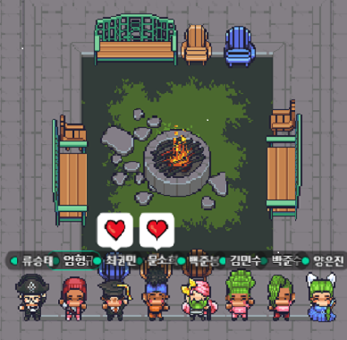

# :rainbow: 알몽

 
 

## :one: 학습 목표

#### 알고리즘 대표 유형과 자료구조 학습

DP, 그리디, 정렬, 탐색 등 대표적인 알고리즘 유형과 문제 풀이에 필요한 자료구조 학습

 
 

## :two: 진행 방식

#### 1일 1알고리즘

매일 1문제 이상의 알고리즘을 풀고 기록 (미준수 시 벌칙)

#### 유형 문제

1) 매주 알고리즘 유형을 주제로 정하기
2) 개념과 자료구조 학습
3) 공통 2문제 해결
4) 매 주 회의에서 개념과 자료구조에 대한 발표, 공통 문제 풀이 공유 및 피드백

 
 

## :three: Repository 구성

- 스터디 폴더 / 개인 폴더 / 월별 폴더 / 알고리즘 사이트 폴더 / `문제 번호.py`

  > ex) almong / seungtae / 22_07 / BOJ / `1000.py`

- 코딩테스트 사이트 폴더명은 대소문자 통일

  > ex) BOJ, SWEA, programmers 등

 
 
